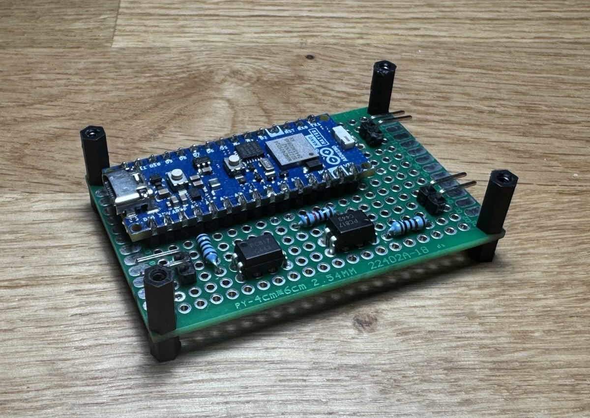
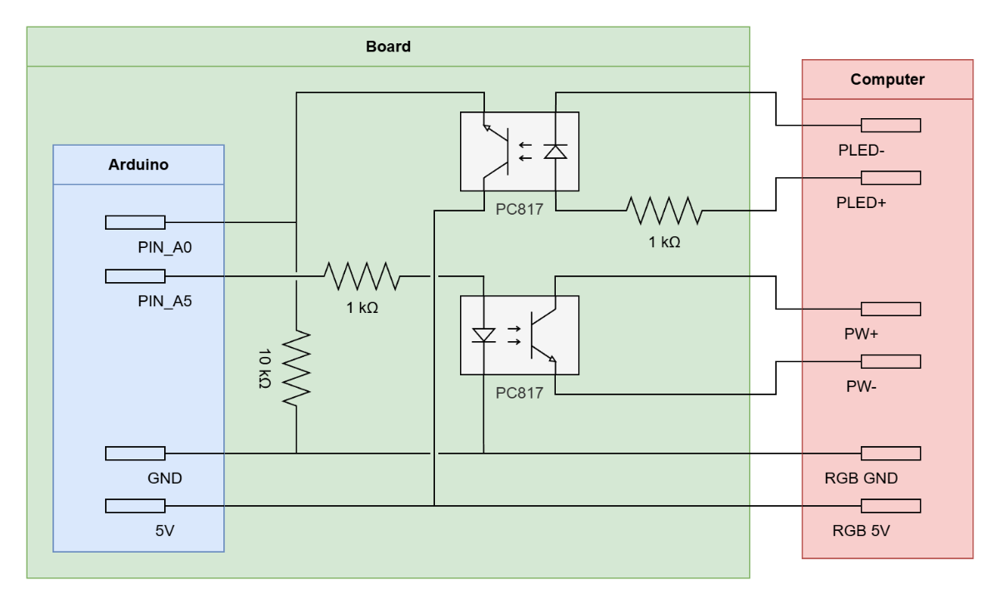

# Matter PC Switch

Remotely control your PC from any smart home platform that support the Matter and Thread standards (Apple Home, Google
Home, Amazon Alexa, Home Assistant, …).

## Features

* Remote power on, shutdown and sleep with ecosystem apps, voice assistants or automation rules
* Power state feedback (the PC appears as an outlet accessory)
* Full local control without a cloud account (depending on your smart home platform)
* Should work with any ATX based motherboard that exposes a front panel power button header
* Fits on a tiny perf-board and is powered directly from the PC (5V RGB header or internal USB)
* Uses Matter-over-Thread

## Bill of Materials

| Quantity | Part                       | Notes                                                                                                                             |
|----------|----------------------------|-----------------------------------------------------------------------------------------------------------------------------------|
| 1        | Arduino Nano Matter        |                                                                                                                                   |
| 2        | PC817 optocoupler          | Interfaces power button and power LED                                                                                             |
| 2        | 1 kΩ resistor              | Current limit for LED side of each PC817                                                                                          |
| 1        | 10 kΩ resistor             | Pulldown for power state sensing                                                                                                  |
| 1        | Perf-board                 |                                                                                                                                   |
| 1        | Thread Border Router       | Refer to this [article](https://www.matteralpha.com/frequently-asked-questions/complete-list-thread-border-routers) for more info |
| -        | Assorted headers and wires | As required                                                                                                                       |

## Assembly

1. **Flash the Firmware:**  
   Upload the sketch `matter-pc-switch.ino` to the Arduino using
   the [Arduino IDE](https://www.arduino.cc/en/software/). Flash unique provisioning data **after** the sketch,
   see [Matter Pairing Codes](#matter-pairing-codes) below.

2. **Pair With Your Smart Home Platform:**  
   On first boot the serial console prints a QR code and manual setup code you can enter in your smart home platform. If
   the pairing process fails, press the onboard user button to reset the Matter pairing process and try again.

3. **Prepare the PC**:  
   In your OS, configure the power button behavior (shutdown or sleep) depending on your preference. In the BIOS, enable
   USB/RGB power in sleep/off states when powering the Arduino from an USB or RGB header.

4. **Wire the Hardware:**  
   Follow the schematic below. One optocoupler simulates a power button press, the other senses the motherboard’s power
   LED so the Arduino always senses whether the PC is on or off.

5. **Enjoy Hands-Free Control**  
   The PC shows up as an outlet accessory named “Computer” in your smart home platform. Control it using voice commands
   or using the ecosystem apps.

## Wiring Schematic

## Matter Pairing Codes

The Arduino Nano Matter ships with test provisioning data. All boards therefore per default use the same Matter pairing
code `3497-011-2332`.

For production use, you should flash unique provisioning data to ensure your Arduino has a unique pairing code. Silicon
Labs provides a simple utility for
this: [Arduino Matter Provision Tool](https://github.com/SiliconLabs/arduino/blob/main/extra/arduino_matter_provision/readme.md#arduino-matter-provision-tool)
